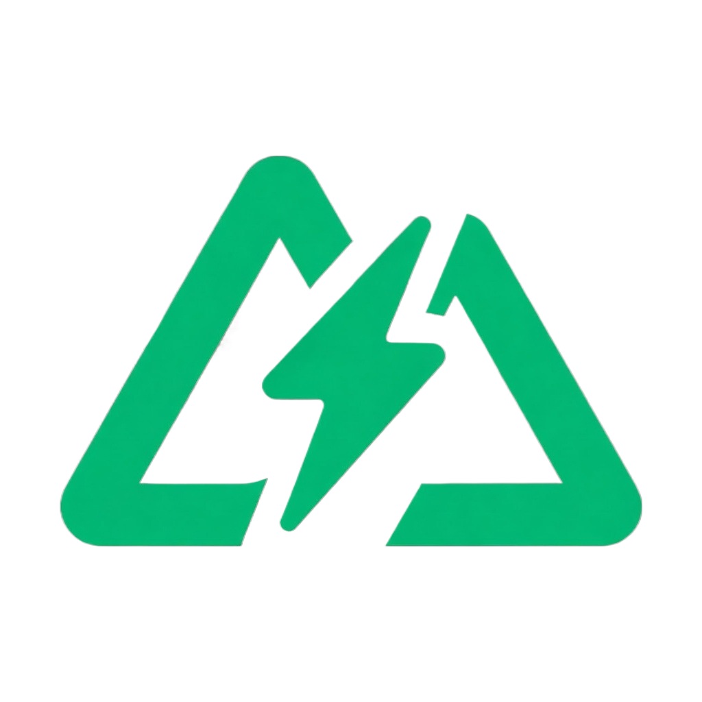

# Nuxt Boilerplate

  
  <h3 align="center">Nuxt Boilerplate v1</h3>

## Description

A production-ready Nuxt boilerplate with latest Nuxt version, built with Feature-Sliced Design
(FSD), Docker support, strict typing, linting, testing setup, and modern
frontend tooling

## Project Purpose

This boilerplate is designed to provide a scalable and maintainable
foundation for commercial and production-grade Nuxt applications. It
includes:

- Feature-Sliced Design architecture
- Dockerized environment
- TypeScript configuration
- State management
- Form validation
- Internationalization
- PWA support
- Linting and Git hooks
- Testing setup
- Built-in libs: vueuse, ufo

The goal is to eliminate repetitive setup work and enforce best
practices from the start.

---

## Technology Stack

| Category             | Tool                 | Puprose                                                                              |
| -------------------- | -------------------- | ------------------------------------------------------------------------------------ |
| Framework            | Nuxt 4               | SSR / SSG meta-framework                                                             |
| UI Layer             | Vue 3, Reka-UI       | Component-based UI                                                                   |
| Language             | TypeScript           | Static typing                                                                        |
| Bundler              | Vite                 | Fast build tool                                                                      |
| Styling              | Tailwind CSS         | Utility-first CSS                                                                    |
| CSS Processing       | PostCSS              | CSS transformations                                                                  |
| State Management     | Pinia                | Centralized state                                                                    |
| Forms                | VeeValidate          | Form handling                                                                        |
| Schema Validation    | Valibot              | Runtime validation                                                                   |
| Animations           | Motion One           | Lightweight animations                                                               |
| Slider               | Swiper               | Touch slider                                                                         |
| Internationalization | Nuxt i18n            | Multi-language support                                                               |
| Content              | Nuxt Content         | Content management                                                                   |
| Testing              | Vitest               | Unit testing                                                                         |
| Linting              | ESLint               | JavaScript/TypeScript linting                                                        |
| Style Linting        | Stylelint            | CSS linting                                                                          |
| Git Hooks            | Husky                | Pre-commit hooks                                                                     |
| Staged Linting       | lint-staged          | Lint staged files                                                                    |
| Containerization     | Docker               | Environment isolation                                                                |
| PWA                  | Vite Plugin PWA      | Progressive Web App support                                                          |
| Images               | Nuxt Image           | Plug-and-play image optimization for Nuxt apps                                       |
| Third-Party          | Nuxt Scripts         | Lets you load third-party scripts with better performance, privacy, security and DX. |
| Built-in             | ufo, VueUse, dotenvx | Convenient features for creating applications                                        |

## Architecture

The project follows Feature-Sliced Design (FSD).

    src/
     ├── app/         # Application initialization layer
     ├── pages/       # Routing layer
     ├── widgets/     # Large self-contained chunks of functionality or UI
     ├── features/    # Reused implementations of entire product features
     ├── entities/    # Business entities
     ├── shared/      # Shared modules and utilities

### Layers

#### app

All kinds of app-wide matters, both in the technical sense (e.g., context providers) and in the business sense (e.g., analytics).

This layer usually doesn't contain slices, as well as Shared, instead having segments directly.

Here are the segments that you can typically find in this layer:

- 📁 assets
- 📁 layouts
- 📁 middleware
- 📁 modules
- 📁 plugins
- 📁 routes
- 📁 service-worker
- app.vue
- error.vue

#### pages

Pages are what makes up websites and applications (also known as screens or activities). One page usually corresponds to one slice, however, if there are several very similar pages, they can be grouped into one slice, for example, registration and login forms.

There's no limit to how much code you can place in a page slice as long as your team still finds it easy to navigate. If a UI block on a page is not reused, it's perfectly fine to keep it inside the page slice.

In a page slice you can typically find the page's UI as well as loading states and error boundaries (📁 ui) and the data fetching and mutating requests (📁 api). It's not common for a page to have a dedicated data model, and tiny bits of state can be kept in the components themselves.

#### widgets

The Widgets layer is intended for large self-sufficient blocks of UI. Widgets are most useful when they are reused across multiple pages, or when the page that they belong to has multiple large independent blocks, and this is one of them.

If a block of UI makes up most of the interesting content on a page, and is never reused, it should not be a widget, and instead it should be placed directly inside that page.

#### features

This layer is for the main interactions in your app, things that your users care to do. These interactions often involve business entities, because that's what the app is about.

A crucial principle for using the Features layer effectively is: not everything needs to be a feature. A good indicator that something needs to be a feature is the fact that it is reused on several pages.

For example, if the app has several editors, and all of them have comments, then comments are a reused feature. Remember that slices are a mechanism for finding code quickly, and if there are too many features, the important ones are drowned out.

Ideally, when you arrive in a new project, you would discover its functionality by looking through the pages and features. When deciding on what should be a feature, optimize for the experience of a newcomer to the project to quickly discover large important areas of code.

A feature slice might contain the UI to perform the interaction like a form (📁 ui), the API calls needed to make the action (📁 api), validation and internal state (📁 model), feature flags (📁 config).

#### entities

Slices on this layer represent concepts from the real world that the project is working with. Commonly, they are the terms that the business uses to describe the product. For example, a social network might work with business entities like User, Post, and Group.

An entity slice might contain the data storage (📁 model), data validation schemas (📁 model), entity-related API request functions (📁 api), as well as the visual representation of this entity in the interface (📁 ui). The visual representation doesn't have to produce a complete UI block — it is primarily meant to reuse the same appearance across several pages in the app, and different business logic may be attached to it through props or slots.

#### shared

This layer forms a foundation for the rest of the app. It's a place to create connections with the external world, for example, backends, third-party libraries, the environment. It is also a place to define your own highly contained libraries.

This layer, like the App layer, does not contain slices. Slices are intended to divide the layer into business domains, but business domains do not exist in Shared. This means that all files in Shared can reference and import from each other.

Here are the segments that you can typically find in this layer:

- 📁 api — the API client and potentially also functions to make requests to specific backend endpoints.
- 📁 ui — the application's UI kit.
  Components on this layer should not contain business logic, but it's okay for them to be business-themed. For example, you can put the company logo and page layout here. Components with UI logic are also allowed (for example, autocomplete or a search bar).
- 📁 lib — a collection of internal libraries.
  This folder should not be treated as helpers or utilities (read here why these folders often turn into a dump). Instead, every library in this folder should have one area of focus, for example, dates, colors, text manipulation, etc. That area of focus should be documented in a README file. The developers in your team should know what can and cannot be added to these libraries.
- 📁 config — environment variables, global feature flags and other global configuration for your app.
- 📁 i18n — setup code for translations, global translation strings.

You are free to add more segments, but make sure that the name of these segments describes the purpose of the content, not its essence. For example, components, hooks, and types are bad segment names because they aren't that helpful when you're looking for code.

---

## Installation

### Install dependencies

Using pnpm:

    pnpm install

Or npm:

    npm install

Or yarn:

    yarn install

---

## Development

Start development server:

    npm run dev

---

## Production

Build the application:

    npm run build

Preview production build:

    npm run preview

---

## Docker

Build Docker image:

    make build

Run container:

    make run

Stop and remove Docker container:

    make stop

Remove Docker image:

    make start

---

## Available Scripts

| Command        | Description              |
| -------------- | ------------------------ |
| dev            | Start development server |
| build          | Build for production     |
| preview        | Preview production build |
| lint:eslint    | Run ESLint               |
| lint:stylelint | Run Stylelint            |
| fsd:lint       | Run FSD steiger linter   |
| fsd:analyze    | Run FSD crawler          |
| test:run       | Once test run            |
| test:watch     | Watch test run           |
| test:coverage  | Generate tests coverage  |

---

## Internationalization

Localization files are located in:

    shared/i18n/locales/

Supported languages can be extended via configuration.

---

## Testing

Unit tests are powered by Vitest.

Run tests:

    npm run test:run

---

## Project Goals

- Enforce scalable architecture
- Reduce onboarding time
- Provide production-ready configuration
- Encourage consistent code standards
- Support team collaboration

---

## License

This project is licensed under the MPL 2.0 License.

## Links

- Author: [@steelWinds](https://github.com/steelWinds)
- Issues: [New issue](https://github.com/steelWinds/nuxt-boilerplate/issues)
- Telegram: @plutograde
- Email: [Send me an email](mailto:kirillsurov0@gmail.com)
